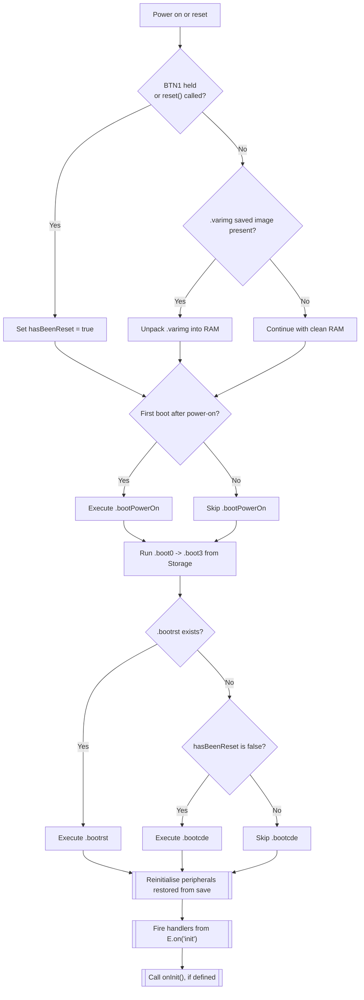

# Boot process described at https://www.espruino.com/Saving

## Notes

- note right of C "Skipping .varimg avoids restoring saved RAM state"
- note right of H "Bangle.js skips this when BTN1 held"
- note right of A "load() follows same steps with hasBeenReset cleared"

## Saving methods overview

| Method | What gets stored | Storage location | Boot-time behaviour | Typical intent | Key characteristics & gotchas |
| --- | --- | --- | --- | --- | --- |
| `save()` | Entire interpreter snapshot: globals, functions, timers, watches, pin states | Compressed `.varimg` image in Storage | If boot wasn’t forced by `reset()`/BTN1, image is restored into RAM, then boot sequence continues (`.boot*`, `E.on('init')`, `onInit()`) | Preserve interactive tweaks and runtime state exactly as last seen | Needs `onInit`/`E.on('init')` to rerun setup; RAM-heavy; code outside functions (comments, formatting) not preserved; repeated `save()` can duplicate timers/watches unless cleared first |
| Save on Send → Flash (`Yes`) | Uploaded JS source | `.bootcde` in Storage | Runs once at boot when `hasBeenReset` is false; skipped after `reset()` | Deterministic startup like traditional firmware | Code stays as plain text; runtime edits can’t be re-saved; nothing executes at upload time; mixing later with `save()` can cause missing flash functions (`Got EOF ... [ERASED]`) |
| Save on Send → Flash, execute after reset (`.bootrst`, deprecated) | Uploaded JS source that must always run | `.bootrst` in Storage | Executes on every boot even after `reset()` (unless BTN1 held on Bangle.js) | Safety-critical routines that must always run, regardless of RAM snapshot | Easy to brick device if code misbehaves; removed from IDE because it’s rarely correct; must clear with `E.setBootCode()` |
| Save on Send → Storage file (`To Storage`) | Uploaded JS source bound to chosen filename | Arbitrary Storage file (e.g. app code) | Not auto-run; load manually with `load(filename)` which then follows normal boot chain substituting that file for `.bootcde`/`.bootrst` | Maintain multiple app images and switch between them | Still flash-backed source; shares pros/cons with Save on Send; requires explicit `load()` call to activate; useful for app launchers or staging different builds |
| Combined (`save()` + `.boot0`…`.boot3`/`.bootPowerOn`) | Mix of RAM snapshot and boot scripts | `.varimg` plus `.boot*` files in Storage | Boot scripts always run before restored RAM state | Layer persistent infrastructure (Wi-Fi creds, init code) on top of modifiable app state | Must manage interactions carefully; boot files run regardless of saved RAM state, so keep them idempotent |
