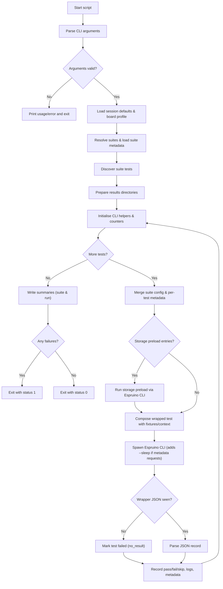

# `scripts/run-tests-gordonV4.js` Execution Flow

This flow diagram mirrors the detailed steps in `docs/run-tests-gordonV4_workflow.md`, with the CLI sleep injection annotated at the execution stage.
