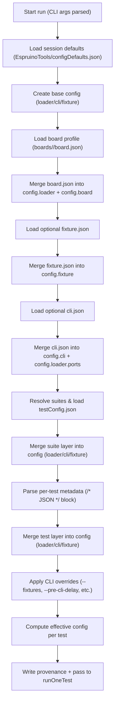

# `run-tests-gordonV4` Metadata Merge Flow

This diagram complements `docs/run-tests-gordonV4_workflow.md`, showing how each metadata layer contributes to the final configuration before a test is executed.
